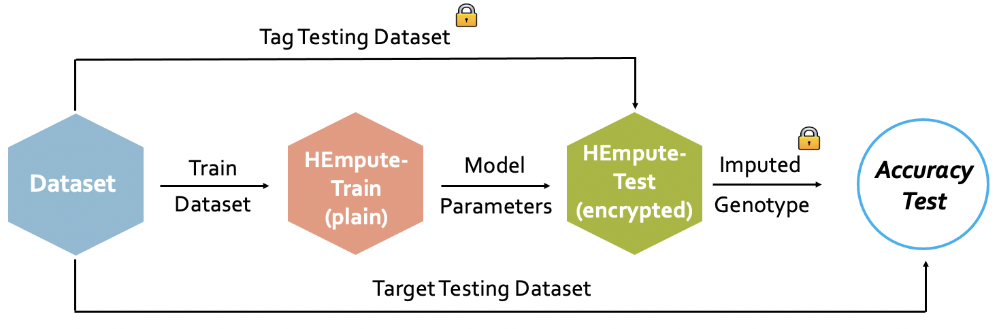
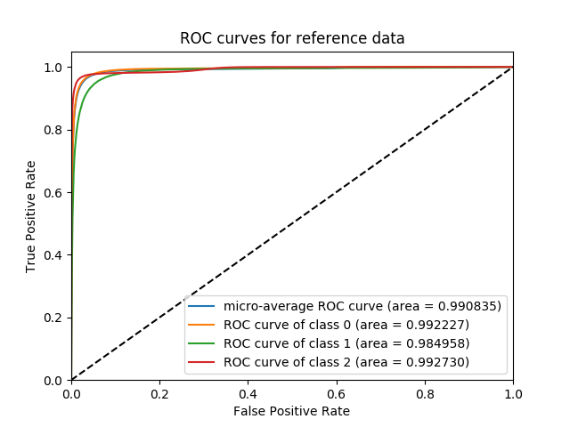

# HEmpute

The UT Health Science Center at Houston (UTHealth) and Microsoft Research (MSR) team presents *secure outsourced genotype imputation protocols* using a linear prediction model based on homomorphic encryption frameworks. HEmpute-Train builds the linear models for secure imputation pipelines of UTMSR-CKKS and UTMSR-BFV. HEmpute-Test provides a C++ implementation of secure genotype imputation protocol using the trained linear models from HEmpute-Train. We present two solutions based on homomorphic encryption cryptosystems - BFV [(https://eprint.iacr.org/2012/144)](https://eprint.iacr.org/2012/144) and CKKS [(https://eprint.iacr.org/2016/421)](https://eprint.iacr.org/2016/421). 

Our paper is available at [https://www.biorxiv.org/content/10.1101/2020.07.02.183459v2](https://www.biorxiv.org/content/10.1101/2020.07.02.183459v2).


## Contents

* [Download](#download)
* [Installation](#installation)
    * [HEmpute-Train Installation](#HEmpute-Train-installation)
    * [HEmpute-Test Installation](#HEmpute-Test-installation)
* [Description of HEmpute](#Description-of-HEmpute)
    * [HEmpute-Train](#HEmpute-Train)
    * [HEmpute-Test](#HEmpute-Test)    
* [Examples](#Examples)
    * [Preparing the Train Data](#Preparing-the-train-data)
    * [HEmpute-Train Example Run](#HEmpute-train-example-run)
    * [Preparing the Test Data](#Preparing-the-test-data)
    * [HEmpute-Test Example Run](#HEmpute-test-example-run)


## Download 

You can download HEmpute code by clicking on the green `Clone or Download` button and downloading zip or by checking out via git. After that, navigate to the checkout (or download) directory. If you downloaded the zip file of the source, unzip it using "unzip master.zip". 

## Installation 

We recommend that you install `HEmpute` into a C++ environment. 

### HEmpute-Train Installation

You need to have g++, gzip, and the GSL libraries installed for building HEmpute-Train. These are installed in most Unix distributions but if they are not installed, type:

```
sudo yum -y install gsl gsl-devel gcc-c++ gzip
```

Now HEmpute-Train can be built using:

```
cd HEmpute-Train
make clean
make
```

The executable is located under directory. 


### HEmpute-Test Installation

We will need to install the followings: m4, texinfo, homebrew, and cmake. You can easily install them by running the following commands :
- m4: `sudo apt-get install m4`
- texinfo: `sudo apt-get install texinfo `
- homebrew:<br>
`mkdir homebrew && curl -L https://github.com/Homebrew/brew/tarball/master | tar xz --strip 1 -C homebrew`  <br>
` /usr/bin/ruby -e "$(curl -fsSL https://raw.githubusercontent.com/Homebrew/install/master/install)"` 
- cmake: `brew install cmake `

Afterward, you can install the modified SEAL library the following commands:

```
cd HEmpute-Test
bash install.sh
```

Then you can install our secure genotype imputation library by running the following commands :

```
cmake . 
make
```

## Description of HEmpute

The whole workflow is depicted as follows:

<p align="center">

</p>


### HEmpute-Train: Plantext linear model training for Secure Imputation

**HEmpute-Train** provides options for processing VCF data to build the text files that the secure imputation methods take as input. 
The code takes as input:
- Tag variant genotypes for the reference population panel, 
- Target variant genotypes for the reference population panel, 
- Optional: the known tag variant genotypes for the study population panel, 
- Optional: the known genotypes of the target variant genotypes for performing accuracy benchmarks. 

and outputs:
- The paramter set for the mean squared-error optimized linear model weights for each target variant -- one file each variant. 
- Optional: The imputed variant genotypes if the study variant genotypes are supplied.  

The study tag and target variants can be used to test the models at the server side to test the accuracy of the plaintext imputation models. The output is formatted as an extended BED file with multiple columns. Please refer below for the specification of output file format.

### HEmpute-Test: Secure Imputation via Homomorphic Encryption

 **HEmpute-Test** evaluates the genotype imputation linear models from HEmpute-Train. Our secure imputation protocols are implemented with Microsoft SEAL version 3.4, which includes implementations of BFV and CKKS. Here are header files:

- `utils_data.h`: File Input/Output
- `utils.h`: utility functions including `scale_and_modt` (scale-up by an input factor followed by modular reduction)  
- `thread.h`: multi-threading function
- `param.h`: security encryption parameter followed by [HomomorphicEncryption.org](https://HomomorphicEncryption.org) security standard. The current parameter provides a 128-bit security level. 
- `HEmpute_bfv.h`: BGV-based underlying functions - encryption of tag variants, evaluation of the linear models, decryption of imputed genotypes 
- `HEmpute_ckks.h`: CKKS-based underlying functions -  encryption of tag variants, evaluation of the linear models, decryption of imputed genotypes 
- `TestHEmpute.h`: detailed implementation of secure genotype imputation protocols
- `main_hempute.h`: test program

## Examples
 
### Preparing the Train Data 

We have included the imputation of common 1kG variants using the tag variants on the Illumina 1M Duo Version 3 array platform as an example. For this, use following:

```
cd HEmpute-Train/example/Illumina_1M_Duo_1kG/1kG
chmod 755 setup.sh
./setup.sh
```

These commands first download the 1000 Genomes Project genotype data, then downloads the array's variant loci, parses the 1000 Genomes Project variants. Then randomly splits the samples into 1500+1004 individuals.

### HEmpute-Train Example Run 

We run HEmpute-Train on the randomly chosen samples to build approximately 81,000 models. 

```
cd HEmpute-Train/example/Illumina_1M_Duo_1kG/Illumina_1M_Duo
chmod 755 setup_run_models.sh
./setup_run_models.sh
```

The parameter set for each variant are stored in files named `pooled_params_0.txt`, `pooled_params_1.txt`, ... where each line corresponds to a target SNP and the columns contain the linear model parameters. You can pool these files and get the whole parameters list in one file and sort the target variants at the same time:

```
cat pooled_params_*.txt | awk 'BEGIN{FS="\t"}{print $NF"\t"$0}' | sort -k1,1 -n | cut -f2- > pooled_params.txt
```

These commands can be used as a template to run other datasets.


### Preparing the Test Data

The `HEmpute-Test/data` directory contains three-types of (compressed) tesing data:
- Tag variant genotypes: tag_testing.txt, tag_testing_AFR.txt, tag_testing_AMR.txt, tag_testing_EUR.txt.
- Target variant genotypes: target_testing.txt, target_testing_AFR.txt, target_testing_AMR.txt, target_testing_EUR.txt.
- target_geno_model_coordinates.txt 

You can also download these data via this [link](https://github.com/K-miran/secure-imputation/tree/master/data).
We excluded the variants at the very end of the chromosome 22 and at the middle of the chromosome (centromere) in the whole target SNPs because we do not have many tag SNPs around those locations. So, the `target_geno_model_coordinates.txt` contains the start coordinates of the target SNPs that were actually used for imputation in our experiment. 

In our protocol, we will input the genotypes in `tag_testing.txt` to the models and accuracy will be tested using target genotype data in `target_testing.txt`. 
The genotype files are tab-delimited and each row corresponds to a SNP. First 4 columns describe the SNP and remaining columns are the genotypes:

```bash
[Chromosome] [Start] [End] [Name] [Genotype for 1st sample] [Genotype for 2nd sample] ...
```

Each genotype is coded as 0/1/2. Also, we perform population stratification, so we divide the training and testing samples into 3 super-populations African (AFR), Americans (AMR), and European (EUR). The same directory contains the training/testing tag/target SNP genotypes for these samples.

The trained parameters are found in the `HEmpute-Test/params` directory. The files are tab-delimited text files. Each row corresponds to a SNP.


### HEmpute-Test Example Run 
The program will run with the BFV or CKKS homomorphic encryption scheme.
For example, we first make a new folder `res` and run the test program `hefoo`  by running main_hempute.cpp as follows:

```
cd HEmpute-Test
./hefoo bfv ALL 16 20000 2 est
```
As in the example, the following list of command-line arguments is given after the name of the test program:
- An HE scheme name (e.g., bfv or ckks).
- Data type (e.g., ALL, AFR, AMR, EUR, LowMAF). 
- Number of threads.
- Number of target SNPs (e.g., 20000, 40000, 80000).
- Vicinity size of the imputation linear model (e.g., 2, 4, 8, 16, 24, 32). That is, each variant genotype is modeled using genotypes of variants within variant vicinity of the variant.
- The output format
    - null: declare nothing in this scope
    - est: output the predicted estimations
    - label: output the prediction labels for 0,1,2
    - microAUC: output the actual genotypes and the estimated genotypes in order to calculate the micro-AUCs
    - macroacc: calculate the macro-aggregated accuracies over all variants and non-reference genotypes. 

For instance, you can run the test program with different inputs:

```
./hefoo bfv ALL 16 20000 2 est
./hefoo ckks AFR 16 40000 16 label
./hefoo ckks AMR 16 40000 16 microAUC
./hefoo ckks EUR 16 80000 32 macroacc
```

Then the results are stored in the `HEmpute-Test/res` directory. 

### Plotting the ROC Curve

We also provide the code to measure the micro-AUC. After running the C++ test program with the `micro-AUC` mode, you can obtain the accuracy results by running `microAUC_evaluation.py` as follows: 

```
cd HEmpute-Test
./python microAUC_evaluation.py -i inputfile -o outputfile
```
For example, if running the test program `./hefoo ckks ALL 16 80000 16 microAUC`, the input list file will be stored as `HEmpute-Test/res/microAUC_ckks_ALL_80000_32.txt`. So, you can run the code by the following command
```
./python microAUC_evaluation.py -i res/microAUC_ckks_ALL_80000_32.txt -o res/microAUC_ckks_ALL_80000_32.png 
```

<p align="center">

</p>
